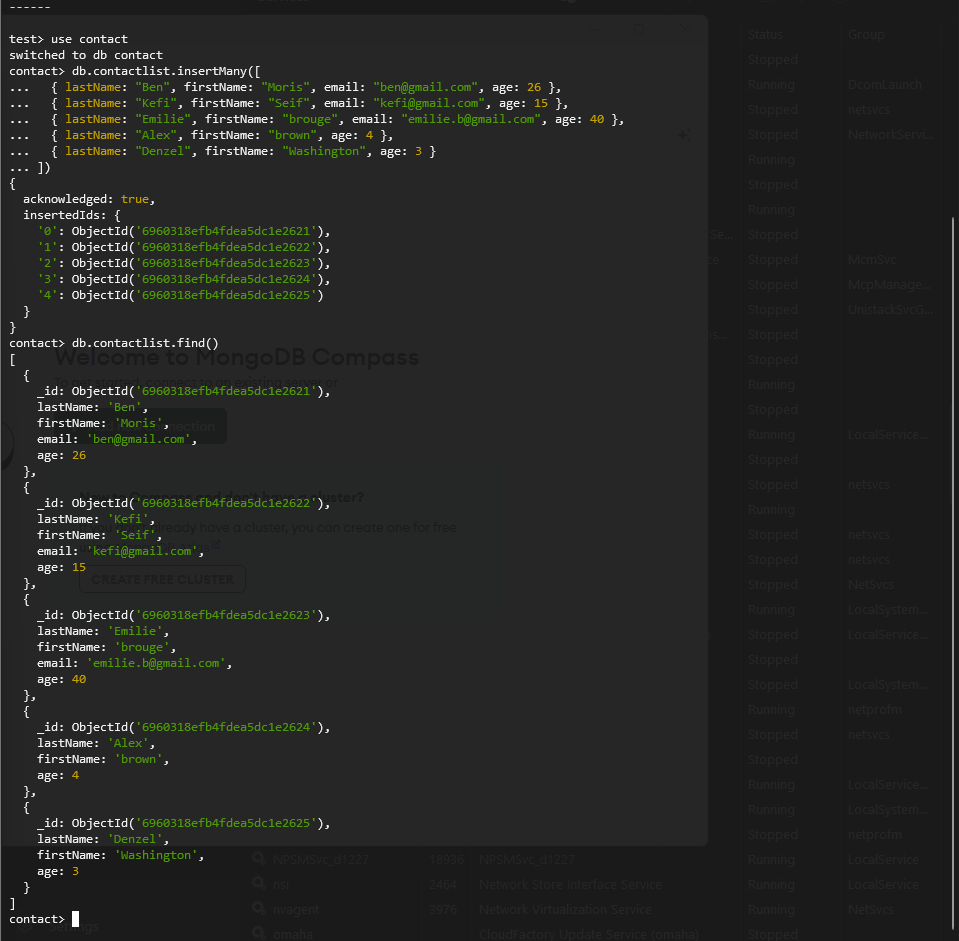
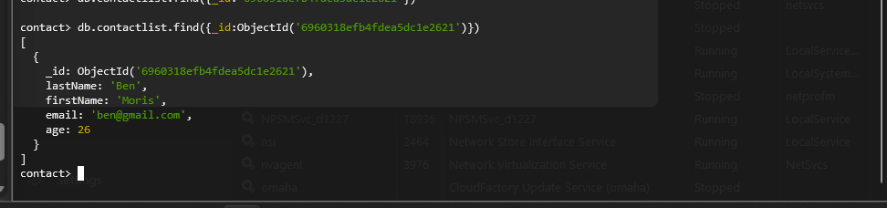
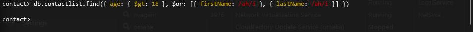
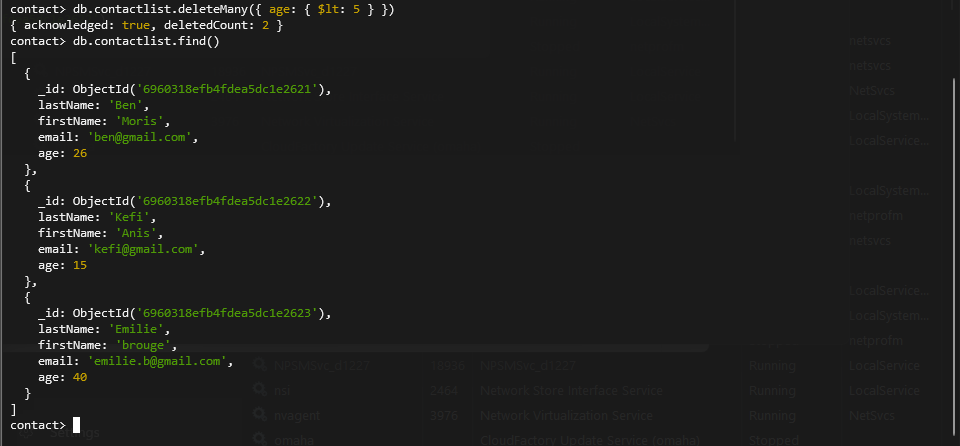

## 📝 MongoDB Assignment Commands

### 1. Database & Collection Creation

In MongoDB, databases and collections are created lazily upon the first data insertion.

```javascript
// Switch to the "contact" database
use contact

// Explicitly create the collection
db.createCollection("contactlist")
```


---

### 2. Insert Documents

Insert the initial dataset into the `contactlist` collection.

```javascript
db.contactlist.insertMany([
  { lastName: "Ben", firstName: "Moris", email: "ben@gmail.com", age: 26 },
  { lastName: "Kefi", firstName: "Seif", email: "kefi@gmail.com", age: 15 },
  {
    lastName: "Emilie",
    firstName: "brouge",
    email: "emilie.b@gmail.com",
    age: 40,
  },
  { lastName: "Alex", firstName: "brown", age: 4 },
  { lastName: "Denzel", firstName: "Washington", age: 3 },
]);
```



---

### 3. Data Retrieval (Read)

```javascript
// Display all contacts
db.contactlist.find();
```

```javascript
// Display one person using their unique ID
db.contactlist.find({ _id: ObjectId("659b...") });
```



```javascript
// Display all contacts with an age > 18
db.contactlist.find({ age: { $gt: 18 } });
```


```javascript
// Display contacts age > 18 and name containing "ah" (case-insensitive)
db.contactlist.find({
  age: { $gt: 18 },
  $or: [{ firstName: { $regex: /ah/i } }, { lastName: { $regex: /ah/i } }],
});
```



---

### 4. Data Modification (Update)

```javascript
// Change the contact's first name from "Seif" to "Anis"
db.contactlist.updateOne(
  { firstName: "Seif", lastName: "Kefi" },
  { $set: { firstName: "Anis" } }
);
```


---

### 5. Data Removal (Delete)

```javascript
// Delete contacts aged under 5
db.contactlist.deleteMany({ age: { $lt: 5 } });
```

---

### 6. Final Verification

```javascript
// Display the final state of the contact list
db.contactlist.find();
```



---

## 📖 Summary

This assignment covers:

- Creating a database and collection
- Inserting multiple documents
- Querying data with filters and regex
- Updating specific fields
- Deleting records based on conditions
- Verifying final dataset state

---
